# Ideal daily review flow

The daily review should turn the active weekly plan into a concrete decision for today.
When recovery or recent training requires a change, it should automatically rebalance the
remaining week without modifying completed days.

```mermaid
flowchart TD
    subgraph Triggers
        scheduled["Scheduled morning review<br/>after sleep data arrives or at cutoff"]
        manual["User selects Generate or Regenerate"]
    end

    scheduled --> request["Create daily-review request"]
    manual --> request

    request --> run["Create ReviewRun<br/>queued status + run ID"]
    run --> duplicate{"Review already running or complete<br/>for today?"}
    duplicate -->|Yes, normal request| existing["Return the existing run/review"]
    duplicate -->|No, or force regenerate| lock["Acquire one review lock for today"]
    lock --> snapshot["Freeze an input snapshot<br/>from the latest locally available data"]

    snapshot --> inputs["Today's active plan, recent sessions,<br/>recovery signals, weekly actions,<br/>and the remaining weekly plan"]
    inputs --> score["Calculate today's readiness score<br/>as a deterministic 0–100 value"]
    score --> metrics["Compute training-recency,<br/>plan-adherence, and remaining-target signals"]

    metrics --> model["Ask the coach model for a structured coaching response"]
    model --> coaching["Train, Train easy, or Rest verdict;<br/>today's prescription and rationale;<br/>revised plan from today through Sunday"]
    coaching --> valid{"Schema, score consistency, safety,<br/>and plan guardrail checks pass?"}
    valid -->|No| repair["Repair or retry with validation feedback"]
    repair --> retries{"Retry budget remaining?"}
    retries -->|Yes| model
    retries -->|No| failed["Mark run failed with an actionable reason<br/>keep the current review and plan unchanged"]

    valid -->|Yes| assemble["Combine the calculated score<br/>with the validated coach output"]
    assemble --> persist["Atomically save the daily review and score<br/>and activate the revised remaining-week plan"]
    persist --> today["Today screen reads this review's stored score,<br/>verdict, prescription, plan changes,<br/>and workout-delivery status"]
    persist --> changed{"Any strength or cardio workout<br/>added, changed, moved, or removed?"}
    changed -->|Yes| publish["Auto-publish the plan changes<br/>using the shared workout-publishing flow"]
    publish --> pushed{"All changes delivered?"}
    pushed -->|No| pending["Keep the revised plan active, record errors,<br/>and retry failed deliveries"]
    pending --> publish
    pushed -->|Yes| ready["Mark ReviewRun complete"]
    changed -->|No| ready
    ready --> delivery["Queue notification delivery"]

    delivery --> quiet{"Quiet hours or temporary<br/>channel failure?"}
    quiet -->|Yes| delay["Delay and retry delivery"]
    delay --> delivery
    quiet -->|No| channels["Send web push, email, and/or Notion<br/>according to preferences"]
```

## Proposed behavior

- The scheduled review runs once each local day after sleep data is available, or at the
  configured morning cutoff. Synchronization is an upstream concern and is not part of
  this review flow.
- Manual regeneration creates a new version for today; a normal duplicate request returns
  the existing review.
- Deterministic code calculates a 0–100 readiness score, recent muscle/system loading,
  plan adherence, and remaining weekly targets before the model interprets them.
- Every successful daily review stores its readiness score. The Today screen displays the
  score from today's latest successful daily review; it does not calculate a separate
  frontend score or read the raw Garmin readiness value directly.
- The model explains and acts on the calculated score but does not invent or overwrite it.
  Validation ensures the verdict and revised plan are consistent with the score.
- The model returns one validated package containing the verdict, today's concrete
  prescription, explanation, warnings, and any required changes through Sunday.
- A successful review automatically activates its revised plan without an approval step.
  Completed and past days are immutable; the user can still edit or regenerate future
  sessions afterward.
- A Train easy or Rest verdict may shorten, replace, or move today's session. The
  remaining days are rebalanced to protect recovery and the weekly targets rather than
  simply dropping the displaced work.
- Any strength or cardio workout created, changed, or moved by the daily review is
  automatically published to Hevy or Garmin. Removed workouts are cleaned up remotely.
  Unchanged workouts are not pushed again.
- Newly generated strength routines choose optimal exercises from the available Hevy
  exercise-template catalog and are not limited to the athlete's existing routines.
  Remote names include the scheduled local date, such as
  `2026-06-19 · Upper Strength` or `2026-06-19 · Easy Run`.
- A moved or revised session updates its Coach-owned Hevy routine or replaces and
  reschedules its Garmin workout, avoiding duplicates and stale scheduled workouts.
- The review, readiness score, and revised plan are committed together before remote
  publishing. A generation failure leaves the prior successful review, displayed score,
  and active plan untouched; a publishing failure records a retryable delivery error.
- Quiet hours delay notifications rather than dropping them.

## Initial scope

- Use the latest data already available in the local database.
- Trigger generation only from the morning schedule or an explicit user action.
- Do not add source-freshness orchestration or regeneration triggered by focus and
  training-block changes.

Workout delivery is detailed in [Ideal workout publishing](./workout-publishing-ideal.md).
