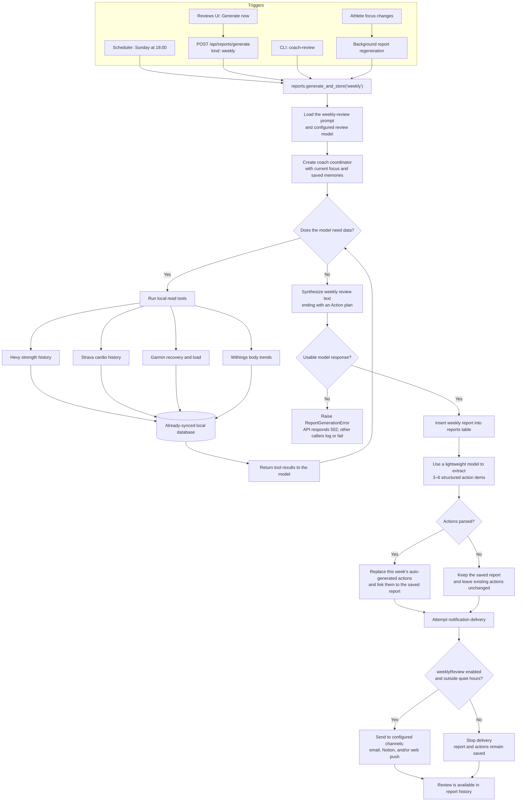

# Current weekly review generation

The data-source tools query Coach's local database, so the review reflects the latest completed sync. Generating a review does not itself fetch fresh data from the external services.
