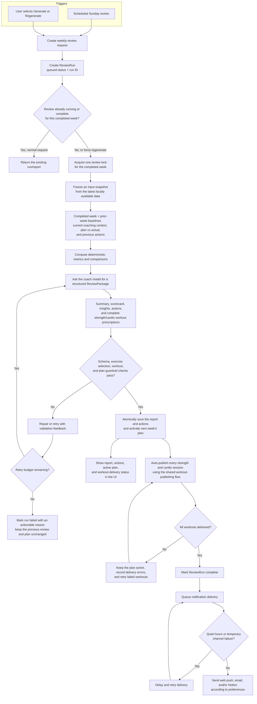

# Ideal weekly review flow

The weekly review should close the completed week and directly prepare the next one. It
should be observable, repeatable, automatic, and safe to regenerate.

## Proposed behavior

- A Sunday review covers the Monday–Sunday week that just ended. Its actions and plan
  target the following Monday–Sunday week.
- Deterministic code calculates totals, trends, plan adherence, and completed prior
  actions. The model interprets those facts instead of discovering every number itself.
- Model output uses one validated package containing the review, actions, and next-week
  plan rather than free-form text followed by separate extraction and planning calls.
- Every strength session contains a newly generated exercise prescription with exercises,
  sets, reps, loads or effort targets, rest, and progression notes. Selection is based on
  the athlete's needs and the available Hevy exercise-template catalog; it is not limited
  to routines the athlete already has saved.
- Every cardio session contains a complete Garmin-compatible workout prescription,
  including sport, duration or distance, intensity targets, and structured steps where
  relevant.
- A regeneration creates a new version. It does not silently delete completed or edited
  actions from an earlier version.
- Recommendations become editable actions for the next week and automatically generate
  the active weekly plan. The user can still adjust or regenerate it afterward.
- The report, actions, and active plan are committed together before remote publishing.
  A generation failure leaves the previous successful review and plan untouched; a
  publishing failure leaves the new local plan active and records a retryable delivery
  error.
- After the plan is activated, strength sessions are automatically created or updated as
  Hevy routines and cardio sessions are automatically created and scheduled in Garmin.
  Each remote name starts with its local scheduled date, for example
  `2026-06-22 · Lower Strength`.
- Remote workout delivery is idempotent and retryable. A regeneration updates or replaces
  Coach-owned remote workouts instead of creating duplicates.
- Quiet hours delay notifications rather than dropping them.

## Confirmed decisions

- A successful weekly review automatically generates and activates the following week's
  plan without an approval step.
- The first implementation uses the latest data already available in the local database;
  it does not add source-freshness checks or synchronization orchestration.
- Only the schedule and an explicit user action trigger generation. Focus and
  training-block changes do not regenerate or mark the review stale.

Workout delivery is detailed in [Ideal workout publishing](./workout-publishing-ideal.md).
