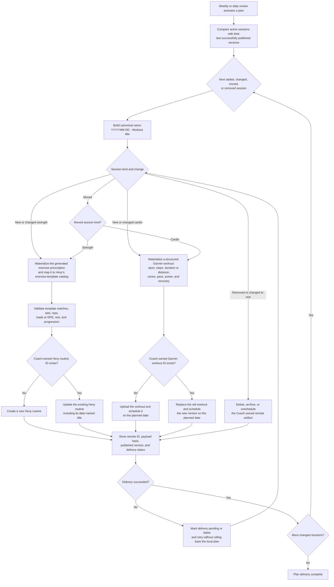

# Ideal workout publishing flow

Weekly and daily reviews share one publishing pipeline. It turns active plan sessions
into complete, date-named workouts in Hevy and Garmin and safely updates them after a
replan.

## Publishing contract

- Strength planning is exercise-first, not routine-first. The planner may create a new
  combination of supported exercises whenever that is better than reusing an existing
  Hevy routine. Existing user-owned routines are never overwritten.
- Exercise choice considers the training goal, movement balance, recent performance,
  fatigue, available equipment, progression, and the Hevy exercise templates that can
  actually be published. If the preferred exercise is unavailable, validation selects an
  appropriate supported alternative rather than silently fuzzy-matching a poor one.
- Cardio workouts are structured prescriptions, not titles plus duration. Garmin receives
  the relevant warm-up, work, recovery, and cool-down steps with supported intensity
  targets.
- Remote workout names use `YYYY-MM-DD · <title>` based on the session's local planned
  date. Moving a workout changes both its name and Garmin schedule.
- Coach stores remote ownership, IDs, a payload hash, and a published version per planned
  session. These fields make retries idempotent and prevent duplicate routines/workouts.
- Local review and plan generation do not roll back when a remote service is unavailable.
  Delivery remains visible as pending or failed and retries independently.
